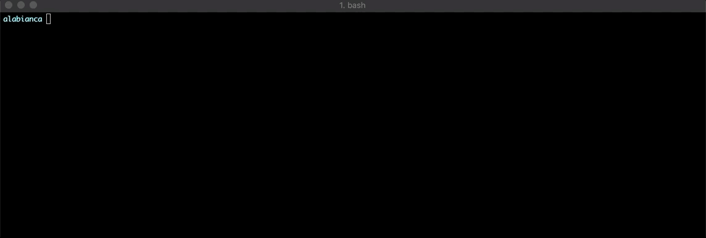

### Godrop
Discover peers in the local network and share files with them.
Godrop utilizes mDNS to discover the local address of potential peers. 

#### Limitations
Godrop will unfortunately only work if the local network supports MDNS.

#### Install
`go get github.com/alabianca/godrop-cli` . Once installed in your GOPATH navigate to the directory and run the install script. `./install.sh`.
This will create a `.godrop` directory in your home directory and install the root TLS certfificate. It will also install the cli into GOPATH/bin
Once this step is complete you should be able to run the `godrop` command. 

#### Usage
Before starting to share files, you need to initialize your local godrop using the `godrop init` command. It will ask you a series of questions like what you want your
user id to be and the port you'd like the godrop server to listen on. It will also generate a unique pseudo domain for you. This domain is important when sharing files over TLS.

Next run the `godrop gencert` command to optain a TLS certificate.

#### Browsing for Peers in the Local Network
To find out who is sharing a file/directory in the local network, run the `godrop ls` command. By default godrop will browse for 5 seconds and returns a list of 
all godrop instances in the local network. You may optionally pass in the `time` flag to override the default browsing time. (`godrop ls -time=10`).

#### Sharing Files/Directories
To share a resource, navigate to the directory that contains the resource you'd like to share and run `godrop advertise [path to file]`. Running this command will
make your machine discoverable by other machines over MDNS. You can optionally provide the `tls` flag to enable TLS. `godrop advertise cats/ --tls`

#### Cloning a Resource
To clone a resource from a peer currently advertising, run `godrop clone [instance]`. This will clone the remote resource into your current working directory. 
The instance argument can be obtained by running `godrop ls` and simply copy the service instance name of one of the results.
